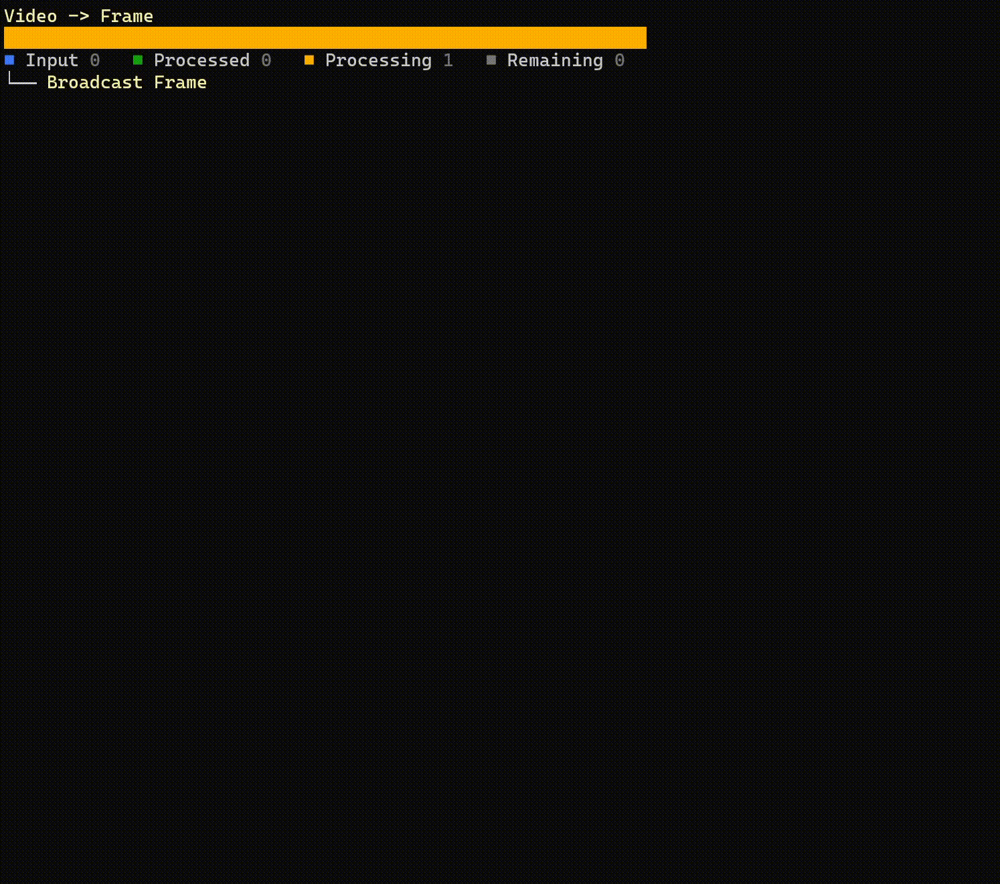

# DeveTPLDataflowVisualizer

This is a library to easily visualize the progress of a TPL Dataflow in a Console application

Usage instructions:
To use this library you should replace all existing TPL Dataflow block names with Deve*****Block. After that you can use the following piece of code to visualize the different blocks:

```
_ = Task.Run(async () =>
{
    var baume = new Tree("Root");
    var baumeNode = new TreeNode(new Text("RootNode"));
    baume.AddNode(baumeNode);
    AnsiConsole.Live(baume)
        .Start(ctx =>
        {
            while (true)
            {
                baumeNode.Nodes.Clear();
                SpectreConsoleRenderer.SuperBaumenMacher(b1_extractFramesFromVideo, baumeNode, (block) => block == b1_extractFramesFromVideo ? 1 : b1_broadcast.ProcessedCount);
                ctx.Refresh();
                Thread.Sleep(50);
            }
        });
});
```

Also, I'm not even german, I was just in a funny mood when making up the names for the `SuperBaumenMacher`...



## Build status

| GitHubActions Builds |
|:--------------------:|
| [](https://github.com/devedse/DeveTPLDataflowVisualizer/actions/workflows/githubactionsbuilds.yml) |

## Intellicode

|  Github Actions (Intellicode) |
|:-----------------------------:|
| [](https://github.com/devedse/DeveTPLDataflowVisualizer/actions?query=GitHubActionsBuilds) |

## DockerHub

| Docker Hub |
|:----------:|
| [](https://hub.docker.com/r/devedse/devetpldataflowvisualizerconsoleapp/) |

## Code Coverage Status

| CodeCov |
|:-------:|
| [](https://codecov.io/gh/devedse/DeveTPLDataflowVisualizer) |

## Code Quality Status

| SonarQube |
|:---------:|
| [](https://sonarcloud.io/dashboard?id=DeveTPLDataflowVisualizer) |

## Package

| NuGet |
|:-----:|
| [](https://www.nuget.org/packages/DeveTPLDataflowVisualizer/) |